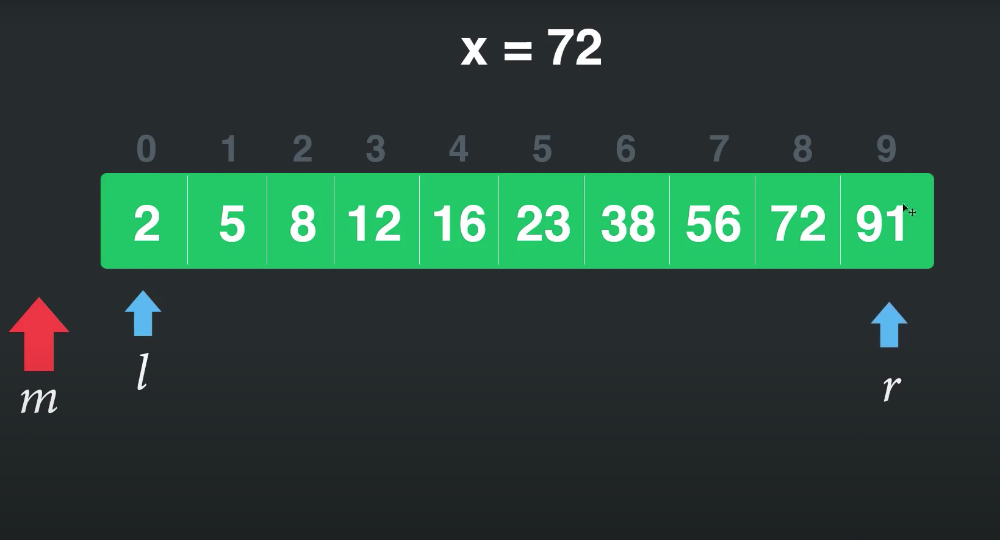
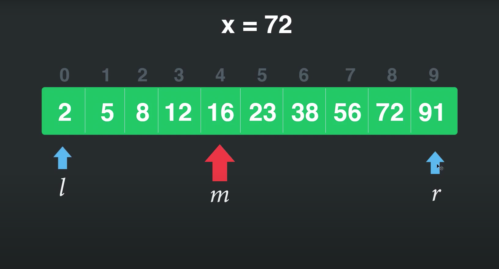
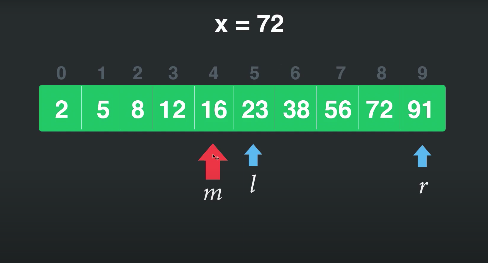
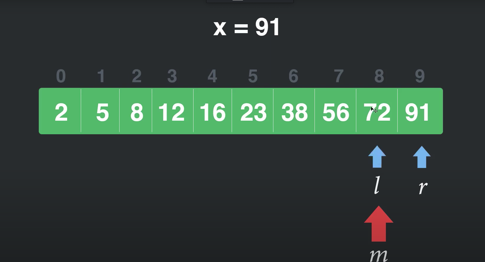

# Guía de ejercicios prácticos para entrevistas técnicas

## 1) Given a string, reverse each word in the sentence

    function reverseString() {

        let string = "Reverse this string"

        let words = string.split(" ")

        let result = []

        for (let i = 0; i < words.length; i++) {
            result.push(words[i].split("").reverse("").join(""))
        }

        result = result.join(" ")

        console.log(result)

    }

## 2) How to check if an object is an array or not? Provide some code.

    function reverseOrNot() {

        var arrayList = [1, 2, 3];

        console.log(Array.isArray(arrayList))

    }

## 3) How to empty an array in JavaScript

    arr = []

> Esto es una forma, pero no es lo recomendado ya que si hay otro array apuntando a la misma dirección, este no cambiará

Forma correcta si hay dos variables duplicadas:

    arr1 = [1, 2, 3, 4]
    arr1Copy = arr1

    arr1.length = 0

    console.log(arr1) // []
    console.log(arr1Copy) // []

    return arr

## 4) How would you check if a number is an integer?

    function isInteger(num) {

        if (num % 1 === 0) {
            return true
        } else {
            return false
        }

    }

## 5) Implement enqueue and dequeue using only two stacks

let inputStack = []
let outputStack = []

    function enqueue(el) {

        if (outputStack.length > 0) {
            // Esto significa que dequeue fué llamado anteriormente, 
            //y debemos vaciarlo para volver a llenar inputStack
            let len = outputStack.length
            for (let i = 0; i < len; i++) {
                let value = outputStack.pop()
                inputStack.push(value)
            }

        }

        inputStack.push(el)
        console.log("Elements after Enqueue: ", inputStack);
    }

    function dequeue() {

        if (outputStack.length === 0) {
            if (inputStack.length === 0) {
                console.log("Queue is empty")
            } else {
                let len = inputStack.length
                for (let i = 0; i < len; i++) {
                    let p = inputStack.pop()
                    outputStack.push(p)
                }
            }
        }

        console.log(`Output stack: ${outputStack}`)

        console.log("Element after dequeue: "
            + outputStack.pop());

        console.log(`Output stack: ${outputStack}`)
    }

>pop() devuelve el último elemento del array

    inputs: 

    // enqueue("a");
    // enqueue("b");
    // enqueue("c");
    // dequeue();
    // enqueue("d");
    // enqueue("e");

    // Output: 

    // Elements after Enqueue:  [ 'a' ]
    // Elements after Enqueue:  [ 'a', 'b' ]
    // Elements after Enqueue:  [ 'a', 'b', 'c' ]
    // Output stack: c,b,a
    // Element after dequeue: a
    // Output stack: c,b
    // Elements after Enqueue:  [ 'b', 'c', 'd' ]
    // Elements after Enqueue:  [ 'b', 'c', 'd', 'e' ]

## 6) Make this work

    duplicate([1, 2, 3, 4, 5]); // response [1,2,3,4,5,1,2,3,4,5]

Respuesta: 

    //Forma 1: usando spread operator

    function duplicate(arr) {
        console.log([...arr, ...arr])
    }

    // Forma 2: usando concat()

    function duplicate2(arr) {
        console.log(arr.concat(arr))
    }

## 7) Write a "mul" function which will work properly when invoked as below syntax

    console.log(mul(2)(3)(4)); // output : 24

Response: 

    // FUNCIONES GENERADORAS/ Closures

    function generadora(x) {

        return function (y) {
            return function (z) {
                return x * y * z
            }
        }

    }

    // generadora(2)(3)(4)

## 8) Write a function that would allow you to do this?

    var addSix = createBase(6);
    addSix(10); // returns 16
    addSix(21); // returns 27

Response:

    // Esto tambien es una funcion generadora, pero ejecutada en dos pasos

    function generadora2pasos(baseNumber) {
        return function (N) {
            return baseNumber + N
        }
    }

    var add8 = generadora2pasos(8)

    add8(5) // 13

    // También puede hacerse en un solo paso add(8)(5)

## 9) FizzBuzz Challenge

- Create a for loop that iterates up to 100 while outputting "fizz" at multiples of 3
- "buzz" at multiples of 5 and 
- "fizzbuzz" at multiples of 3 and 5.

    function fizzbuz() {

        for (let i = 1; i <= 100; i++) {
            let f = i % 3 == 0
            let b = i % 5 == 0;
            console.log(f ? (b ? i + " fizzBuzz" : i + " fizz") : (b ? i + " buzz" : i))
        }

    }

## 10) Given two strings, return true if they are anagrams of one another

    var firstWord = "Mary";
    var secondWord = "Army";

    function isAnagram(first, second) {
        // For case insensitivity, change both words to lowercase.
        var a = first.toLowerCase();
        var b = second.toLowerCase();

        //El método sort me ordena el array de A a Z entonces podemos comparar
        // sin necesidad de usar reverse()

        // Sort the strings, and join the resulting array to a string. Compare the results
        a = a.split("").sort().join("");
        b = b.split("").sort().join("");

        return a === b;
    }

## 11) How would you use a closure to create a private counter?

    function counter(){
        let _counter = 0

        return {
            add: () => _counter++,
            retrieve: () => _counter
        }
    }

    let getCounter = counter()
    let add = getCounter.add()
    let counterValue = getCounter.retrieve()

    console.log(counterValue) // 1

## 12) Provide some examples of non-bulean value coercion to a boolean one

### The specific list of "falsy" values in JavaScript is as follows:

- "" (empty string)
- 0, -0, NaN (invalid number)
- null, undefined
- false

>Any value that's not on this "falsy" list is "truthy." Here are some examples of those:

- "hello"
- 42
- true
- [ ], [ 1, "2", 3 ] (arrays)
- { }, { a: 42 } (objects)
- function foo() { .. } (functions)

## 13) What will be the output of the following code?

    var y = 1;
    if (function f() {}) {
    y += typeof f;
    }
    console.log(y);

#### A tener en cuenta: 

    (function f(){})

- Esto crea la función 
- Nombra la función f
- Crea dentro de la misma función una variable f conteniendo la referencia
- Typeof solo devuelve strings
- Al f no existir fuera de ella el typeof devuelve undefined como string
- Teniamos 1 y undefined
  
> La respuesta por lo tanto es "1undefined"

#### Otro caso hubiera sido el siguiente

    var y = 1;
    if (f = function f() {}) {
    y += typeof f;
    }
    console.log(y);

En este caso al si existir referencia externa a la función el resultado hubiera sido "1function"

## 14) What will the following code output?

    (function() {
    var a = b = 5;
    })();

    console.log(b);

> El output sería 5

#### Explicación:

- var tiene scope de función por lo tanto no puede ser accedida por fuera
- en la función se escribe var a = b = 5 pero nunca se define a la variable a 
- al no haber declarado b, se interpreta a b con un valor de 5 en el scope global 

## 15) What will be the output of the following code?

    var output = (function(x) {
    delete x;
    return x;
    })(0);

    console.log(output);

> operador delete: sirve para solo eliminar una propiedad de un objecto. Ej:

let obj = {name: "nico", age: 22}

delete obj.name

console.log(obj) // {age: 22}

> Por lo tanto el ejercicio devolverá x normalmente ya que no puede borrar un parámetro que no sea una propiedad de un objeto

## 16) What will be the output of the following code?

    var Employee = {
    company: 'xyz'
    }
    var emp1 = Object.create(Employee);
    delete emp1.company
    console.log(emp1.company);

> El método Object.create() crea un objeto nuevo, utilizando un objeto existente como el prototipo del nuevo objeto creado. 

****

Para entender este ejercicio hay que saber que al crear el objeto usando el método object.create, este objeto es una instancia del objeto padre, por lo tanto a todas las propiedades las tendrá en el prototipo, no en el mismo. Entonces al usar el método delete (que recordemos borra propiedades de un objeto, pero no borra al prototipo) este no tendrá ningun efecto por lo tanto devolverá 'xyz'. 

> Para borrar las propiedades con delete se podrá haber hecho entrando en el prototipo:

    delete emp1.__proto__.company

****

## Ejercicio de búsqueda binaria recursiva

****

Para entender la búsqueda binaría es importante primero entender como funciona gráficamente. 

En este gráfico contamos con: 
* La incógnita(x)
* La variable right(r)
* La variable left(l) 
* La variable que sería el buscador(m).
* Un array ya ordenado 

Para comenzar la búsqueda, el primer paso es sumar las variables left y rigth y dividirlas por 2 (en caso de ser número con coma, aproximo al menor)

> Esta primera operación sería: (0 + 9)/2 = 4,5 = 4 (aproximo al menor)

Este valor sería el valor de m, una vez calculado debo comparar si m es igual a x, en caso de serlo hemos llegado al resultado.

En este caso como m = 4, el valor que le corresponde al array es 16, por lo tanto es menor a x.

> Si el valor de m es menor a x debo mover l a la derecha m + 1 posiciones y repetir el cálculo hasta que arr[m] sea igual a x

)

> El cálculo ahora sería (5 + 9)/2 = 7

Repito de nuevo el procedimiento ya que arr[m] no es igual a x

> El cálculo sería (8 + 9)/2 = 8.5 = 8 (aproximo al menor)

En este caso el array en m, es decir en la posición 8 es igual a 72, que es el valor de nuestra incógnita, con esto hemos dado con la solución (8).