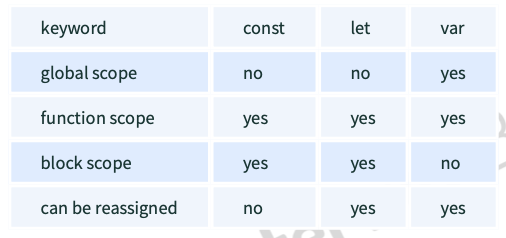

# Estudio para entrevistas técnicas

## Tipos de datos: 

En javascript hay dos grupos de tipos de datos, los datos **Primitivos** y los **No primitivos**

### 1. Datos Primitivos:

1) **String**
2) **Number**
3) **Boolean**
4) **Undefined**
5) **Null**
6) **Symbol** (guarda información unica, fue introducido en ES6)
   
   Ej: 

         var symbol1 = Symbol('symbol');

- Tipos de datos usando typeof
  
      typeof "John Doe" // Returns "string"
      typeof 3.14 // Returns "number"
      typeof true // Returns "boolean"
      typeof 234567890123456789012345678901234567890n // Returns bigint typeof undefined // Returns "undefined"
      typeof null // Returns "object" (kind of a bug in JavaScript) typeof Symbol('symbol') // Returns Symbol

### 2. Datos No Primitivos:

      Los datos primitivos solo pueden almacenar datos simples, para usar datos múltiples es necesario usar datos no primitivos. Tambien cabe recalcar que cualquier tipo de dato que no sea primitivo es de tipo Object

## Hoisting:

Es el comportamiento normal de Javascript donde todas las declaraciones de funciones y variables son movidas al principio

      hoistedVariable = 3;
      console.log(hoistedVariable); // outputs 3 even when the variable is declared after it var hoistedVariable;

También funciona en el scope local

> "Recordar que solo las declaraciones de variables son llevadas al inicio"

      var x;
      console.log(x); // Outputs "undefined" since the initialization of "x" is not hoisted 
      x = 23;

> Para evitar el hoisting puede usarse el modo estricto al principio del código

      "use strict";
      x = 23; // Gives an error since 'x' is not declared var x;

## Diferencia entre let,var y const 

- Var: Tiene scope de función
- Const y let: Tienen scope local o de bloque

## Coerción de datos en Javascript

Por lo general, es el intérprete de Javascript el que realiza la conversión de tipos por nosotros de forma interna buscando adaptarse a nuestras operaciones.

Por ej: 

      var a = "1",
      b = 5;
      
      console.log( typeof a, typeof b); // string number
      console.log( a + b ); // 15

> Pero esto es así porque el operador + es a la vez concatenador y suma, prevaleciendo la primera de sus funciones cuando la situación lo permite.

Otro ejemplo interesante es cuando involucramos valores lógicos:

> console.log( true + true ) // 2

### Otros casos curiosos:

      true == 1; //true! (converts true to bit value 1)
      true - false === 1 //true!!!
      "2" + 2; //22!
      "2" - 2; //0
      "2" - - 2; //4
      NaN == NaN; //false - this one sort of makes sense since NaN is any non-Number cast to a number
      NaN  NaN; //false - whatever!
      "" == 0 //true
      undefined == null //false!
      "0" == 0 //true!
      "false" == false //false!!!'
      '\t\r\n ' == 0 //true!!! - essentially an empty string which coerces to 0

> Aclaración: Todos los valores excepto false, 0, 0n, -0, "", null, undefined y null son valores falsos los cuales serán convertidos a False

var x = 0
var y = 30

if(x){
 console.log(x)
} // Este bloque no correrá ya que el valor 0 es falso

### Operadores Lógicos:

- Operador OR (||): Si el primer valor es verdadero entonces retorna el primero, de lo contrario se retorna el segundo valor.

> Explicación: Siempre devuelve el positivo 0 || 1 // retorna 1

> Si ambos son postivos o negativos, retorna el **primer** valor

- Operador AND (&&): Si ambos valores son verdaderos, entonces retornará el segundo. De otra forma retornará el valor que sea falso de los dos.

> Explicación: 1 && 0 // retorna 0
> Si ambos son postivos o negativos, retorna el **segundo** valor

      var x = 220
      var y = "hello"
      var z = undefined

      x || y // retorna 220
      x || z // retorna 220
      x && y // retorna "hello"
      y && z // retorna undefined (1 && 0)

      if (x && y){
            // el código se ejecuta 
      }

      if(x || z){
            //el código se ejecuta
      }

## ¿Es Javascript un lenguaje de tipado dinámico o de tipado estático?

Javascript es un lenguaje de ***Tipado dinámico***, el tipo de una variable es checkeado durante la ejecución (run-time), mientras que en el tipado estático es checkeado en la compilación.

> Al Js ser de tipado dinámico, las varibles no están asociadas a ningun tipo de dato, por lo tanto pueden reescribirse sin problema alguno.

      var a = 23;
      var a = "Hello World!";

## Propiedad Nan:

> "Not-a-Number": indica si un valor es un número. **Su typeof es Number**

Para ver si un valor es Nan, se usa la funcion isNaN().

      isNaN("Hello") // Returns true
      isNaN(345) // Returns false
      isNaN('1') // Returns false, since '1' is converted to Number type which results in 0 
      isNaN(true) // Returns false, since true converted to Number type results in 1 ( a number)
      isNaN(false) // Returns false
      isNaN(undefined) // Returns true

## Valores pasados por valor y por referencia:

> - Los tipos de datos primitivos son pasados por valor y no por referencia, es decir no apuntan al mismo espacio en memoria

> -  Los tipos de datos no primitvos son pasados por referencia y no por valor, es decir apuntan al mismo espacio en memoria

      var y = 234; 
      var z = y;

      var y = #8454; // y pointing to address of the value 234
      var z = y;
      var z = #5411; // z pointing to a completely new address of the value 234
      // Changing the value of y
      y = 23;
      console.log(z); // returns 234 since z points to another adress in memory, so changing the values will not modify the other variables.

      var obj = { name: "Vivek", surname: "Bisht" }; 
      var obj2 = obj;

      var obj = #8711; // obj pointing to address of { name: "Vivek", surname: "Bisht" } 
      var obj2 = obj;
      var obj2 = #8711; // obj2 pointing to the same address 
      // changing the value of obj1
      obj1.name = "Akki"; 
      console.log(obj2);
      // Returns {name:"Akki", surname:"Bisht"}

## Funciones Autoejecutables: 

      (function(){
       // Do something;
      })();

* El primer par de paréntesis es para que el compilador no dé error, ya que al leer function el espera que se declare una función, entonces al poner el primer par de paréntesis solventamos esto
* El segundo par de paréntesis es para invocar a la función 

## Modo estricto 'use strict'

Práctica admitida en modo normal pero no admitida en strict mode|Ejemplo|
|--------|--------|
|   Uso de variables no declaradas   |    	nombre = 'juan';   |
|    Borrar una variable u objeto usando delete   |    delete nombre;   |
|Definir una propiedad dos veces | 	var x = {persona:'juan', persona:'juan'};|
|Nombres de parámetros duplicados | function saludar(persona, persona) {};|
|Usar eval como nombre de variable | eval = 'aprobado';|
|En una función si no se conoce this es el objeto global window | En una función si no se conoce this es undefined|

## Palabra this:

El "this" hace referencia al objeto de donde es parte la función

Ejemplos: 

      function doSomething() { console.log(this);
      } doSomething();
> En este caso el objecto de donde es parte esa función es el objeto global, por lo tanto retornará el objeto global, si estamos en el navegador ese objeto sería window.

      var obj = {
      name: "vivek",
      getName: function(){
      console.log(this.name); }
      } 
      obj.getName();
> En este segundo caso si hay un objeto que contiene a esa función, por lo tanto this hará referencia al objeto **obj** y retornará "vivek".

      var obj = {
      name: "vivek", 
      getName: function(){ console.log(this.name);
      } }
      var getName = obj.getName;
      var obj2 = {name:"akshay", getName }; 

      obj2.getName();

> En este caso se retornará akshay porque el contexto de la ultima llamada a la función, es obj2. Existe un truco que dice que para saber el contexto del this, basta con mirar al objecto que se encuentra antes del punto. En el ejemplo anterior: obj2.getName() el contexto de this seria obj2.

## Metodos call(), apply() y bind():

### call(): este método ejecuta la función pasando el objecto que sería el contexto

      function sayHello(){
      return "Hello " + this.name;
      }
      var obj = {name: "Sandy"}; 

      sayHello.call(obj);
      // Returns "Hello Sandy"
  
Otro ejemplo:

      var person = {
      age: 23,
      getAge: function(){
      return this.age; }
      }
      var person2 = {age: 54};
      person.getAge.call(person2); // Returns 54

Call() tambien recibe argumentos:

      function saySomething(message){ 
            return this.name + " is " + message;
      }
      var person4 = {name: "John"};
      saySomething.call(person4, "awesome"); // Returns "John is awesome"

### apply():
Es identico a call(), la unica diferencia es que los parámetros se reciben como array.

      function saySomething(message){
             return this.name + " is " + message;
      }
      var person4 = {name: "John"}; 
      saySomething.apply(person4, ["awesome"]);

### bind()
Retorna una **nueva función**, donde el this es el que se pasó como parámetro

      var bikeDetails = {
            displayDetails: function(registrationNumber,brandName){
            return this.name+ " , "+ "bike details: "+ registrationNumber + " , " + brandName;
      } }
      var person1 = {name: "Vivek"};
      var detailsOfPerson1 = bikeDetails.displayDetails.bind(person1, "TS0122", "Bullet"); // Binds the displayDetails function to the person1 object
      detailsOfPerson1();
      // Returns Vivek, bike details: TS0452, Thunderbird

## Métodos exec() y test()
Son métodos pertenecientes a RegExp
- exec() busca el patrón y devuelve los resultados, de no encontrar nada devuelve "empty".
  
      console.log(/^([a-z]+) ([A-Z]+)$/.exec("hello WORLD"))  
      // Output:
      [ 'hello WORLD', 
      'hello', 
      'WORLD', 
      index: 0, 
      input: 'hello WORLD', 
      groups: undefined ] 

- test() funciona de la misma manera, pero de encontrar un patrón este devuelve true, caso contrario devuelve false
  
      console.log(/^([a-z]+) ([A-Z]+)$/.test("hello WORLD"))
      //Output: 
      true
      
## Currying
Es el proceso en el cual una función que recibe varios arguementos, se transforma en múltiples funciones de un solo argumento

Ejemplo de función normal: 

      function sumar(a,b){
      return a + b
      }

      console.log(sumar(5,6)) // returns 11

Ejemplo de la misma función con currying

      function sumar(a){
      return function(b){
            return a + b
            }
      }

      let resultado = sumar(5)(6)

      console.log(resultado) // returns 11

> Prestar atencion al bloque **sumar(5)(6)**, como puede verse deben pasarse los parámetros por separado, ya que estamos hablando de que la primer función retorna otra función.

Ejemplo mas complejo:

      function multiply(a,b){ 
            return a*b;
      }

      function currying(fn){ 
            return function(a){
                  return function(b){ 
                        return fn(a,b);
                  }
            }     
      }

      var curriedMultiply = currying(multiply);

      multiply(4, 3); // Returns 12 
      curriedMultiply(4)(3); // Also returns 12

## Scope:

En terminos generales entender el scope sirve para saber que a variables o funciones se puede acceder en deteminada parte del código.

Hay 3 tipos de scope:
- Scope global:
  Son las escritas en la parte principal del código es decir que no están dentro de otros bloques. Por ej: 

      var globalVariable = "Hello world";
      function sendMessage(){
       return globalVariable; // can access globalVariable since it's written in global space
      }
      function sendMessage2(){
       return sendMessage(); // Can access sendMessage function since it's written in global space}
      sendMessage2(); // Returns “Hello world”

- Scope de función/local: Son las que están escritas dentro de una función en particular. Por ej:

      function scopeLocal(){
      var a = 50
      }

      console.log(a) // da error ya que a está definida dentro del bloque

- Scope de bloque: 
  >Solo tienen scope de bloque las variables declaradas con let y const. **var no lo tiene**

El scope de bloque hace referencia a que dentro de un bloque **{ }** cualquier variable let y const definida dentro de este, no podrá ser accedida por fuera de ese bloque.

      {
      let x = 45;
      }
      console.log(x) // nos da error ya que la variable solo pertenece al bloque donde fué declarada;

> El modo en el que Javascript busca variables es del scope mas chico al global

## Tipos de errores en Javascript:

1. Errores de sintaxis
2. Errores lógicos
   
## Memoization:
Cuando una función hace la misma tarea varias veces, podemos ahorrar poder de cómputo y guardar esa respuesta en memória para acelerar tiempos. Ese es el concepto principal de memoization.

Ejemplo:

      var cache = {}

      function addTo10(num){
      if(num in cache){
            console.log("cached value")
            return cache[num]
      }else{
            cache[num] = num + 10
            return cache[num]
      }
      }

      console.log(addTo10(10)) // la primera vez retorna 20
      console.log(addTo10(10)) // la segunda vez retorna 20 y cached value
      console.log(cache) // {'10': 20}

## Recursión: 
Es el proceso por el cual una función itera llamándose repetidamente a ella misma.

Ejemplos: 

- 1

      function add(num){
      if(num <= 0){
            return 0
      }else{
            return num + add(num - 1)
      }
      }

      console.log(add(3))

      // 3 + add(2)
      // 3 + 2 + add(1)
      // 3 + 2 + 1 + add(0)
      // 3 + 2 + 1 + 0 = 6

 - 2
  
            function computeSum(arr) {
            if (arr.length === 1) {
                  return arr[0];
            }
            else {
                  return arr.pop() + computeSum(arr);
            }
            }
            computeSum([7, 8, 9, 99]); 

            // Resultado
            // 99 + [7,8,9]
            // 99 + 9 + [7,8]
            // 99 + 9 + 8 + [7]
            // 99 + 9 + 8 + 7
            // 123  

## Funciones constructoras

Se pueden crear con funciones o clases.
Ejemplo: 

      class Persona {
      constructor(name, age) {
            this.name = name
            this.age = age
            }
      }

      const persona1 = new Persona("nico", 22)

      function PersonaFunction(name, age) {
      this.name = name
      this.age = age
      }

      const persona2 = new PersonaFunction("luly", 21)

  
## charAt(): 
Método de string, que devuelve el caracter en cierto índice

       const string = "Hola mundo"

      console.log(string.charAt(2)) // returns "l"

## BOM:

El browser object model permite la interacción con el navegador. Mediante BOM, es posible redimensionar y mover la ventana del navegador, modificar el texto que se muestra en la barra de estado y realizar muchas otras manipulaciones no relacionadas con el contenido de la página HTML. Su objecto principal es Window.

## Arrow functions:

Introducidas en es6 con nueva y mas corta sintaxis

- Son declaradas sin la palabra function
- Si solo hay una línea de código entonces no hay necesidad de usar la palabra return
- Si solo recibe un solo parámetro no hace falta poner () 
- Tampoco es necesario usar {} si es una sola línea

      // Traditional function expression
      var multiplyBy2 = function (num) {
      return num * 2;
      }
      // Arrow function expression
      var arrowMultiplyBy2 = num => num * 2;

> Una diferencia muy importante es como la arrow function interpreta el this, ya que devuelve el contexto de afuera de ella

      var obj1 = {
      name: "nico",
      getName: function(){
            return this.name
      }
      }

      var obj2 = {
      name: "nico",
      getName: () => this.name,
      valueOfThis: () => this
      }

      console.log(obj1.getName()) // returns "nico"
      console.log(obj2.getName()) // returns undefined
      console.log(obj2.valueOfThis()) // returns global object

## var, let y const: 

      {
      var variable3 = [1, 2, 3, 4];
      }
      console.log(variable3); // Outputs [1,2,3,4]
      {
      let variable4 = [6, 55, -1, 2];
      }
      console.log(variable4); // Throws error
      for (let i = 0; i < 2; i++) { //Do something
      }
      console.log(i); // Throws error
      for (var j = 0; j < 2; i++) { // Do something
      }
      console.log(j) // Outputs 2

## Operadores rest y spread

**rest** (...):

El operador rest nos sirve para manejar todos los elementos que pueda recibir una función sin especificarlos. 

> El operador rest convertirá los parametros recibidos en un array

      function extractingArgs(...args) {
      return args[1];
      }
      // extractingArgs(8,9,1); // Returns 9
      function addAllArgs(...args) {
      let sumOfArgs = 0;
      let i = 0;
      while (i < args.length) {
            sumOfArgs += args[i];
            i++;
      }
      return sumOfArgs;
      }
      addAllArgs(6, 5, 7, 99); // Returns 117 addAllArgs(1, 3, 4); // Returns 8

> Nota: El operador rest debe siempre usarse como último parámetro de la función.

**spread** (...):

Si bien si sintaxis es identica al rest, este operador funciona para abrir un array u objeto. Es usado para por ejemplo pasar elementos simples de una array a una funcion.

> Este operador convierte los arrays en elementos simples para que la función pueda recibirlos.      

      function receiveSpread(name, surname, age){
      return `Hello ${name} ${surname} your age is ${age}`
      }

      const arrayOfData = ["Nicolas", "Chiarello", 22]

      const response = receiveSpread(...arrayOfData)

      console.log(response) // Hello Nicolas Chiarello your age is 22

> Se podría decir que estos operadores funcionan de forma análoga, rest junta los parametros que recibe la función y los convierte en arrays, mientras que spread hace lo contrario, este se usa para pasar elementos a la función de manera singular.

## Promesas: 
Las promesas sirven para tratar código asíncrono, podemos destacar que una promesa se puede encontrar en uno de estos estado: 

- Pendiente/Pending
- Resuelta/Fullfilled
- Rechazada/Rejected

> Una promesa se ejecuta usando new Promise(), esta función recibe una callback con dos argumentos que son resolve y reject.

      new Promise((resolve, reject) => {
      resolve("hola")
      })

> Para llamar a una función que retornó una promesa debemos hacer uso de then() y catch()

      function promiseSum() {
      return new Promise((resolve, reject) => {
            setTimeout(() => {
                  resolve("hola")
            }, 2000)
      })
      }

      promiseSum().then((res) => console.log(res))

## Clases
Son azucar sintáctica de las funciones constructoras.

      class Persona{
      constructor(name,age){
            this.name = name
            this.age = age
      }   
      getName = function(){
            return this.name
            }
      }

      const persona1 = new Persona("nicolas", 22)

Puntos clave de las clases: 
- A diferencia de las funciones, las clases no son hoisteadas, es decir no se pueden usar antes de su declaración
- Una clase puede heredar propiedades y métodos de otras clases usando la palabra extends

## Funciones generadoras 
Introducidas en es6, son funciones que van paso a paso retornando valores intermedios cuando se le diga

> Las funciones generadoras se declaran como function*

Para retornar valores intermedios se usa la palabra yield, y para llamar a la función a que avance se usa next()

      function* iteratorFunc() {
      let count = 0;
      for (let i = 0; i < 2; i++) {
            count++;
            yield i;
      }
      return count;
      }
      let iterator = iteratorFunc();
      console.log(iterator.next()); // {value:0,done:false} 
      console.log(iterator.next()); // {value:1,done:false} 
      console.log(iterator.next()); // {value:2,done:true}

Otro ejemplo: 

      function* genFunc() {
      yield 3;
      yield 4;
      return true
      }

      let iterator = genFunc()

      console.log(iterator.next())
      console.log(iterator.next())
      console.log(iterator.next())

      //Output
      // { value: 3, done: false }
      // { value: 4, done: false }
      // { value: true, done: true }

## Set:

Permite almacenar elementos únicos sin repetirse

      var array1 = ["nico", "nico", "gime", "paula"]

      const set1 = new Set(array1)

      console.log(set1) // Set(3) { 'nico', 'gime', 'paula' }

      set1.add("vivi") // Set(4) { 'nico', 'gime', 'paula', 'vivi' }

      set1.delete("nico") // Set(3) { 'gime', 'paula', 'vivi' }

      set1.has("paula") // true

      console.log(set1.size) // 3

      set1.clear() // Set(0) {}

## WeakSet

Es muy similar al set convencional, pero con la diferencia de que el weakset solo puede recibir
objetos y solo tiene tres métodos que son add(), delete() y has() .

      var newWeakSet = new WeakSet()

      obj1 = {name: "nico"}
      obj2 = {name: "paula"}

      newWeakSet.add(obj1)
      newWeakSet.add(obj2)

      console.log(newWeakSet)

      // Output 
      // WeakSet {{…}, {…}}
      // [[Entries]]
      // 0: Object
      // 1: Object
      // [[Prototype]]: WeakSet

## Map

El objecto Map guarda elementos clave-valor únicos

      const codigosPostales = new Map([[12,"lujan"], [15, "gCruz"]])

      console.log(codigosPostales)

      // Output
      // Map(2)
      // [[Entries]]
      // 0: {12 => "lujan"}
      // key: 12
      // value: "lujan"
      // 1: {15 => "gCruz"}
      // key: 15
      // value: "gCruz"
      // size: 2

El WeakMap al igual que el weakset solo recibe objetos como parámetros

## Object destructuring

      const obj = {name: "nico", edad: 22}

      const {name, edad} = obj

      console.log(name) // "nico"
      console.log(edad) // 22

## Array destructuring

      const arr = ["primerValor", "segundoValor"]

      const [primerValor, segundoValor] = arr

      console.log(primerValor) // "primerValor"
      console.log(segundoValor) // "segundoValor"

